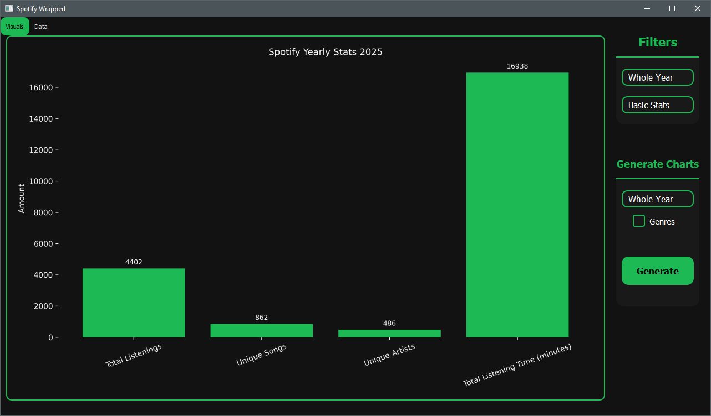

# 🎧 Custom Spotify Wrapped

**Your personal year in music — fully under your control.**

Create your own Spotify Wrapped with:
- Top artists & songs
- Monthly listening trends
- Genre breakdowns
- Google Sheets integration
- A sleek interactive GUI

---

## 🚀 Features

✅ No waiting for Spotify  
✅ Total customization  
✅ Visualizations tailored to *you*  
✅ Free and open-source



---

## 📥 How to Get Started

You’ll need:
1. A [Spotify Developer Account](https://developer.spotify.com/)
2. A [Google Sheet linked via IFTTT](https://ifttt.com/applets/nin7BxVm-keep-a-log-of-your-recently-played-tracks)
3. Python 3.11+  
4. One command:  
   ```bash
   pip install git+https://github.com/WilleGyr/Spotify_Wrapped.git@main
